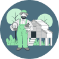

<h1 align="center">
    
</h1>

<h3 align="center">
  An application to register your tractors
</h3>

<p align="center">

  <a href="#">
    
  </a>

  <a href="LICENSE" >
    
  </a>

</p>


## 📆 About

This app permites you to create a list of tractors updated in real time.


## 💻 How to execute the project

To run the project source code you'll need Node.Js on your machine.

[Download NodeJs here](https://nodejs.org/en/download/)

MongoDb is also required

[Download MongoDb here](https://www.mongodb.com/try/download/community)


If you have all installed, follow this steps in your terminal:

> git clone https://github.com/Ed-Games/solutionsSeed.git

Add a  `.env` file in /backend folder and create this variable to connect to your database.

```.env

NODE_DATABASE_CONNECTION_STRING="your mongoDB connection string"

```
> cd backend

> npm start

Let the server runing and open another terminal in the project folder.

> cd frontend

> npm start


## 📝 License

This project is licensed under the MIT license. See the [LICENSE](/LICENSE) file for details.

Please, if you are going to create another project with the same images and artwork, give credit to the authors: <br>
<a href="https://storyset.com/business">SVG illustrations by Storyset</a><br>
<a href="https://www.blobmaker.app/">Blobs SVG made by Blobmaker</a>

## 🖼️ Images
<h1 align="center">
    
</h1>
<h1 align="center">
    
</h1>
<h1 align="center">
    
</h1>
<h1 align="center">
    
</h1>
<h1 align="center">
    
</h1>

